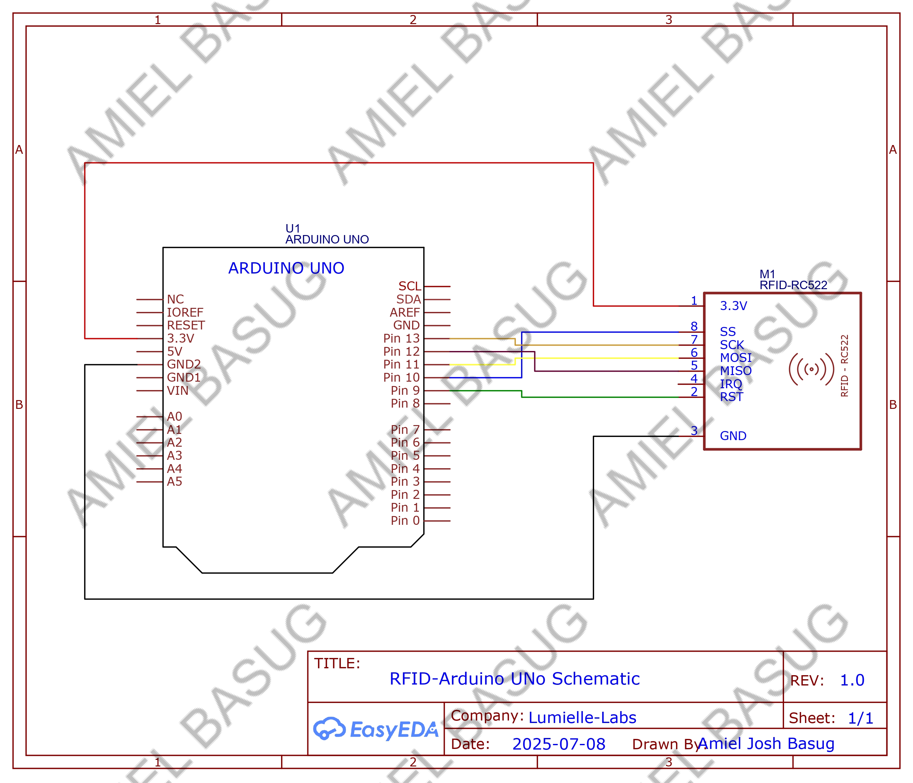

# Arduino-RC522-Rfid tester
A simple Arduino project using the MFRC522 RFID module to read and display RFID tag UIDs on the Serial Monitor.

[](LICENSE)
[]()

---

## Description
This project uses an **RFID-RC522 module** with Arduino to read RFID tags and display the UID on the Serial Monitor. Ideal for beginners in electronics and embedded systems.

---

## Features
- Read RFID tag UID
- Display UID on Serial Monitor
- Beginner-friendly code
- Works with Arduino Uno

---

## Requirements
- Arduino Uno
- RFID-RC522 module
- RFID tag/card
- Jumper wires
- Arduino IDE
- `MFRC522` library by Miguel Balboa

---

## Wiring / Setup
| RC522 Pin | Arduino Pin |
|-----------|-------------|
| SDA or SS | 10          |
| SCK       | 13          |
| MOSI      | 11          |
| MISO      | 12          |
| RST       | 9           |
| 3.3V      | 3.3V        |
| GND       | GND         |  

  
> **Important:** Use 3.3V only, not 5V.  
---
## Code

### Code for Testing (testcode.ino)
```cpp
#include <SPI.h>
#include <MFRC522.h>

#define SS_PIN 10   // SDA
#define RST_PIN 9

MFRC522 rfid(SS_PIN, RST_PIN);

void setup() {
  Serial.begin(9600);
  SPI.begin();        // Init SPI bus
  rfid.PCD_Init();    // Init MFRC522
  Serial.println("Scan RFID tag...");
}

void loop() {
  // Look for new cards
  if (!rfid.PICC_IsNewCardPresent()) return;
  if (!rfid.PICC_ReadCardSerial()) return;

  Serial.print("UID Tag: ");
  for (byte i = 0; i < rfid.uid.size; i++) {
    Serial.print(rfid.uid.uidByte[i] < 0x10 ? "0" : "");
    Serial.print(rfid.uid.uidByte[i], HEX);
    Serial.print(" ");
  }
  Serial.println();
  
  // Halt PICC
  rfid.PICC_HaltA();
  // Stop encryption on PCD
  rfid.PCD_StopCrypto1();
}

```  
---

## Installation
1. Install Arduino IDE from [https://www.arduino.cc/en/software](https://www.arduino.cc/en/software)
2. Install `MFRC522` library via Arduino Library Manager
3. Connect your RFID module according to the wiring table
4. Upload the [test code](Docs/testcode.ini) sketch to your Arduino

---

## Usage
1. Open Arduino Serial Monitor (baud rate: 9600)
2. Place RFID tag near the module
3. Serial Monitor will display the UID like:
   ```text
    Scan RFID tag...
    UID Tag: 04 A3 1B 5F
    Scan RFID tag...
    UID Tag: 12 7C 9D 4A
    Scan RFID tag...
    UID Tag: 08 2F C1 7E
    ```


---

## Troubleshooting
- Ensure the module is powered with 3.3V
- Check wiring carefully
- Install MFRC522 library
- Hold the RFID tag close (1–3 cm) to the antenna
- Make sure baud rate in Serial Monitor is 9600

---

## Related Repository
For C# app integration and setup, see: [Arduino RFID RC522 Winforms Integration](https://github.com/juswa005/Arduino-RC522-Rfid-Winforms-Integration-.git)

---

## License
This project is licensed under the [MIT License](LICENSE).

---

## Author
Amiel Josh Basug


